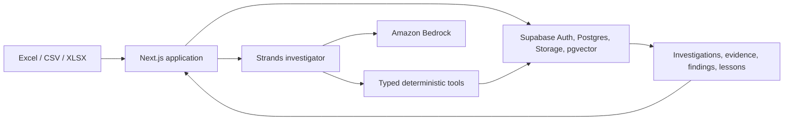

# Margin Memory

> Before you send an estimate, Margin Memory checks whether you are repeating something that has cost your company before.

Margin Memory is a pre-submit review and learning system for small electrical contractors and owner-estimators. It imports completed-job estimates and actual costs, preserves their provenance, lets the estimator verify what was learned, and reviews new estimates against that trusted company history.

The product is deliberately not a replacement for Excel, Accubid, McCormick, Bluebeam, QuickBooks, or a contractor's job-cost system. Those tools remain where estimates and actuals originate. Margin Memory sits between estimating and submission as an evidence-backed professional review layer.

## What it does

```text
completed estimates + actual job costs
              ↓
deterministic import and reconciliation
              ↓
estimator-verified lessons and trusted company history
              ↓
new estimate → Margin Check
              ↓
0–3 evidence-backed findings or focused questions
              ↓
submission → outcome → closeout → future learning
```

The closed-loop lifecycle is enforced by database RPCs:

```text
draft → reviewed → submitted → won → in_progress → completed
                            ↘ lost

completed → actuals → learning_review → learned
```

Submission snapshots preserve the estimate revision, warnings, and supporting evidence that existed when the bid was submitted.

## Trust model

Margin Memory follows one rule:

> The agent decides what deserves investigation. Deterministic TypeScript and persisted evidence determine what is true.

- Financial and labor calculations run in typed deterministic tools.
- Model output cannot introduce authoritative arithmetic.
- Findings must reference evidence retrieved or calculated during the current investigation.
- Only reconciled, authoritative, non-demo completed jobs can become trusted history.
- Only estimator-confirmed lessons become trusted company memory.
- Embeddings are bound to their provider, model, dimensions, content hash, and current source record.
- Incomplete actuals, unknown commercial baselines, stale vectors, quarantined jobs, and demo data fail closed.
- Supabase row-level security and tenant-safe foreign keys prevent cross-company access.
- Humans retain control over prices, labor hours, markup, submission, and commercial commitments.

## Main workflows

### Historical onboarding

Start with 3–5 recent completed jobs that resemble the work you want to review. Upload one estimate/actual pair, or select up to ten of each and let Margin Memory propose strong filename matches. Every proposed pair remains editable and receives its own review contract. Shared project/customer context can be applied visibly across a batch; analysis and commits still run one job at a time.

Margin Memory detects worksheets, headers, mappings, quantities, labor hours, totals, categories, and rollups. Clean files follow an exception-light path; ambiguity requires focused review; unsafe financial interpretation is blocked. Approved scope changes can be entered directly or pasted from a reviewed Excel/CSV table into the same deterministic reconciliation structure.

The import layer includes:

- strict numeric parsing and source-total reconciliation;
- partial-actual and structural coverage detection;
- SHA-256 review contracts binding preview to commit;
- immutable estimate revision and baseline identity;
- line-level file, worksheet, row, and mapping provenance;
- private source staging, transactional commits, and idempotent retry;
- bounded CSV/XLSX parsing and tenant-scoped storage.

Historical imports return as soon as the authoritative transaction and durable memory work are recorded. Embedding preparation continues after the response and retains its existing retry state if the external model is temporarily unavailable.

The files under `samples/` are synthetic examples for local evaluation. They are not customer records.

### Margin Check

A current estimate enters the same hardened import boundary. One server-side Strands investigator chooses focused retrieval and inspection tools. Amazon Bedrock supplies the model, while deterministic tools own numerical claims. The result is findings, a persisted human question, a legitimate zero-finding result, or an explicit failure.

### Excel add-in

The included Office add-in adds **Margin Check** to Excel. It captures only a selected visible worksheet, table, or range; it never edits workbook values. The snapshot enters the same review-contract, revision, preflight, evidence, and tenant boundaries as the web application.

### Closeout and learning

Won jobs progress through execution and closeout on the same estimate lifecycle. Actual costs are reconciled against the submitted baseline and approved changes. Warning outcomes and proposed lessons require human review before the job reaches `learned`.

## Architecture



Technology:

- Next.js 16, React 19, and TypeScript
- Supabase Auth, Postgres, private Storage, RLS, and pgvector
- Strands Agents SDK for TypeScript
- Amazon Bedrock for investigation models
- Titan G1 or Cohere Embed v4 for independent 1536-dimensional embeddings
- Vitest, disposable PostgreSQL/pgvector tests, and Playwright
- Optional Bedrock AgentCore runtime adapter

Supabase remains the system of record. AgentCore, when enabled, hosts only the existing agent runtime and does not own authentication, lifecycle, financial data, evidence, or memory.

## Repository structure

```text
src/app/                 Next.js pages and authenticated API routes
src/components/          estimator-facing and Excel task-pane UI
src/lib/spreadsheet.ts   canonical CSV/XLSX interpretation
src/lib/agent/           Strands runtime, tools, leases, and provenance
src/lib/domain/          lifecycle, scope, memory, and evidence rules
src/lib/repository/      tenant-aware persistence services
src/lib/integrations/    Excel live-snapshot boundary
src/runtime/             optional AgentCore HTTP adapter
supabase/migrations/     forward-only schema and security migrations
tests/                   unit, database, browser, and adversarial regressions
samples/                 synthetic example imports
office-addin/            Excel manifest template
```

## Requirements

- Node.js 22.12 or newer
- npm
- A Supabase project
- An AWS account with access to the selected Bedrock models
- PostgreSQL 18 and pgvector for disposable database tests
- Chromium or Chrome for browser tests

## Environment

Copy the example file and fill in the values used by your environment:

```bash
cp .env.example .env.local
```

| Variable | Purpose |
| --- | --- |
| `NEXT_PUBLIC_SUPABASE_URL` | Supabase project URL used by the browser and server. |
| `NEXT_PUBLIC_SUPABASE_PUBLISHABLE_KEY` | Browser-safe Supabase publishable key; RLS still controls access. |
| `SUPABASE_SECRET_KEY` | Server-only key for narrow trusted operations. Never expose it to the browser. |
| `AWS_REGION` | AWS region, normally `us-east-1`. |
| `BEDROCK_MODEL_ID` | Bedrock model or inference-profile ID used by Strands. |
| `EMBEDDING_PROVIDER` | `bedrock`. Embeddings remain independent from the investigation model. |
| `BEDROCK_EMBEDDING_MODEL_ID` | `amazon.titan-embed-text-v1` or another explicitly supported 1536-dimensional model. |
| `AGENT_RUNTIME` | `local` or `agentcore`. |
| `AGENTCORE_RUNTIME_ARN` | Required only when `AGENT_RUNTIME=agentcore`. |
| `OFFICE_ADDIN_ORIGIN` | HTTPS origin used when generating the Excel manifest. |

AWS credentials use the standard SDK chain. Use an AWS profile locally and an IAM role in deployment. Do not commit access keys or `.env.local`.

A cost-conscious development configuration can use:

```dotenv
AWS_REGION=us-east-1
BEDROCK_MODEL_ID=us.amazon.nova-lite-v1:0
EMBEDDING_PROVIDER=bedrock
BEDROCK_EMBEDDING_MODEL_ID=amazon.titan-embed-text-v1
AGENT_RUNTIME=local
```

Model availability, inference profiles, quotas, and pricing vary by AWS account and region.

## Local setup

```bash
npm install
cp -n .env.example .env.local

supabase login
supabase link --project-ref YOUR_PROJECT_REF
supabase db push --dry-run
supabase db push

export AWS_PROFILE=YOUR_PROFILE
npm run smoke:bedrock
npm run dev
```

Open `http://localhost:3000`.

In Supabase Auth, configure the application Site URL and allowed redirect URLs for the origin you use. The email confirmation template should resolve to:

```text
{{ .SiteURL }}/auth/confirm?token_hash={{ .TokenHash }}&type=email
```

The repository uses Supabase email/password authentication. Social login is not configured.

## Excel manifest

Deploy the web application to an HTTPS origin, then generate the origin-bound add-in manifest:

```bash
OFFICE_ADDIN_ORIGIN=https://your-domain.example npm run excel:manifest
```

The generated file is `.generated/excel/manifest.xml` and is intentionally ignored by Git. Deploy it through Microsoft 365 Integrated Apps or sideload it in a compatible development tenant. Add the same origin and `/integrations/excel/auth-complete` URL to Supabase Auth's allowed redirects.

The add-in requests read-only workbook access. It contains no Supabase secret, AWS credentials, or database credentials.

## Verification

```bash
npm install
npm ls
npm run verify
npm run typecheck
npm run lint
npm test
npm run test:db
npm run build
PLAYWRIGHT_CHROMIUM_EXECUTABLE=/usr/bin/google-chrome npm run test:browser
git diff --check
```

`npm test` runs the Vitest suites. `npm run test:db` creates an isolated local PostgreSQL cluster and applies every migration from zero. Set `PG_BIN` if PostgreSQL is installed outside the default location. Browser tests can use Playwright's Chromium or `PLAYWRIGHT_CHROMIUM_EXECUTABLE`.

## Deployment

Build and run the web container:

```bash
docker build -t margin-memory-web .
docker run --rm --env-file .env.local -p 3000:3000 margin-memory-web
```

Put a stable HTTPS domain in front of the service, configure Supabase Auth redirects, apply migrations before the application rollout, and give the server an IAM role permitted to invoke only the selected Bedrock models. Keep the Supabase secret and AWS credentials in the deployment's server-side secret store.

For AgentCore, build `Dockerfile.agentcore` for `linux/arm64`, push it to ECR, create an AgentCore runtime role, and generate the runtime configuration with:

```bash
npm run agent:iam -- AWS_ACCOUNT_ID
npm run agent:config -- IMAGE_URI RUNTIME_ROLE_ARN
```

After AgentCore reports `READY`, configure the web deployment with `AGENT_RUNTIME=agentcore` and its runtime ARN. The normal `local` Bedrock runtime remains the fallback deployment mode.

## Security boundaries

- Browser clients receive only the Supabase publishable key.
- Service credentials and Bedrock calls remain server-side.
- Privileged routes derive the user and organization from the authenticated session.
- Private source files are tenant-scoped in Supabase Storage.
- Direct browser mutation of trusted vectors, lesson status, import contracts, and operational state is blocked.
- Demo and synthetic records are visibly labeled and excluded from trusted evidence.
- The Excel task pane sends only the selected visible source and never hidden or unrelated sheets.

## Current validation boundary

The deterministic import, lifecycle, tenant, memory, provenance, and retry behavior has automated regression coverage. Local Bedrock model and Titan embedding smoke tests have succeeded with configured credentials.

The following still require external pilot validation:

- representative, permissioned contractor exports from real estimating and job-cost systems;
- a complete authenticated journey against the final hosted Supabase deployment;
- Excel desktop and Excel web behavior in the target Microsoft 365 tenant;
- optional AgentCore deployment in the target AWS account;
- Microsoft Marketplace review or organizational add-in approval.

Synthetic fixtures demonstrate failure handling and invariants, but they do not prove compatibility or retrieval relevance for every contractor's records.
